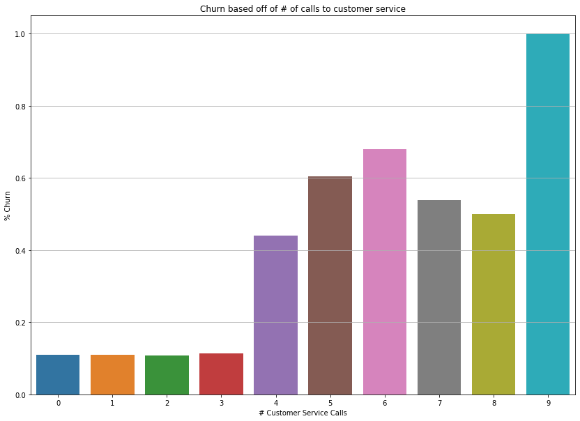
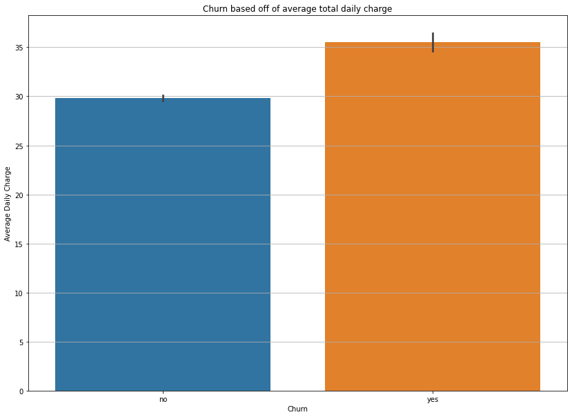

# Telephone Company Churn Predictions

## Classifying whether customers will churn or not

## Author: Joseph Lim

### Business Problem: 

Predicting when a customer will leave a service, is important for preventing a customer from leaving a service. Preventing customers from leaving a service, results in greater profits for a company as well as any stakeholders. Alternatively, predicting when a customer is past the stage of salvaging, allows a company to more efficiently utilize resources that may be spent on a customer. 

This project was aimed at predicting when a customer would "churn", or leave their current telecommunication company.

### Data:

Taken [from Kaggle](https://www.kaggle.com/competitions/customer-churn-prediction-2020) as part of a contest, the dataset consisted of 4250 rows and 19 features, along with the one target column.

### Methods

#### Data Cleaning
* No severe outliers occurred during data cleaning.

#### Classification Analysis
* Accuracy was used to analyze the classifications, as finding whether a customer would churn or not was the main crux of the problem. 

### Results

#### Churn Based on # Of Calls to Customer Service

> Please view this image in "Day Mode" for best viewability. We can see from this graph, that after 3 phone calls, the percentage of customers that churn rises from a relatively stable 10%, to a more volatile > 40%, and customers fully churn at 9 calls.

#### Churn in relation to average total charge

> Please view this image in "Day Mode" for best viewability. We can see from this graph, that customers that churn, are paying more daily than customers that don't churn, and at roughly $5 more than non-churning customers.

### Model
The final model used was a tuned Decision Tree, which has an accuracy score of 94% classification. A logistic regression was created and tested, however after tuning, failed to reach a higher accuracy score. 

### Recommendations

#### Recommendation 1:
Based off of an analysis of customer service calls, I recommend investing in higher quality customer service. There is a marked increase in customer churn after a customer make the 3rd phone call. Decreasing how many times customers need to contact customer service, may result in lower churn.

#### Recommendation 2:
Analyzing overall correlations showed a distinct relationship between churn and the amount of money charged to customers for daytime calls. Customers who churned paid roughly $5 more on average than customers that didn't churn. This group should be looked into further to determine if customers should be offered lower prices.

### Limitations & Next Steps
* More EDA could be run on this data set in order to provide more aesthetically pleasing graphs and visuals to choose from.

* More hyperparameter tuning could be done on models, and more models could be utilized, to see if there is a more optimal model.

* Model Boosting could be implemented in order to increase accuracy scores ideally.

### For further information

Please send me an email @ jplim96@gmail.com. 
